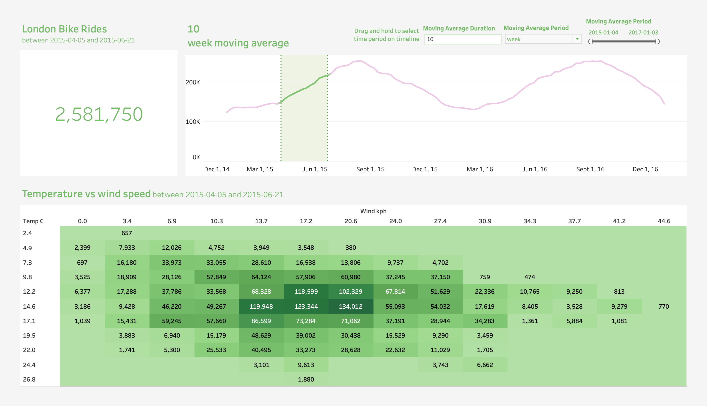
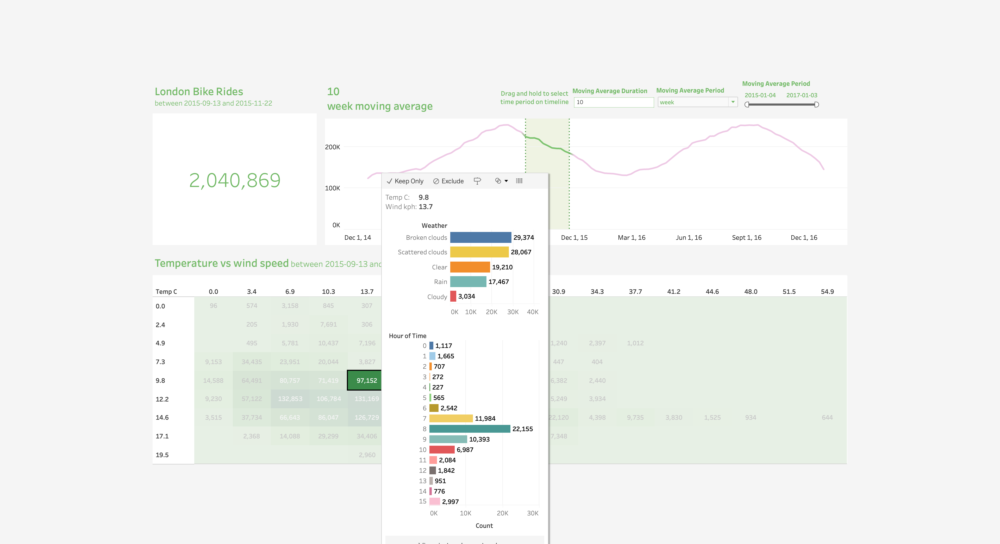
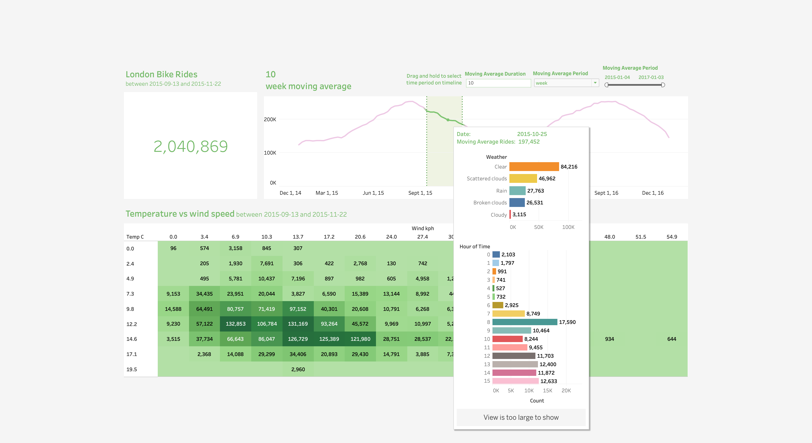

### Dashboard Overview

Here is an overview of the dashboard:

- At the top, a headline metric displays the total number of rides within the selected period.
- A line graph depicts a 10-week moving average of bike usage, highlighting trends over time. Users can adjust the average duration and period.
- Below, a heatmap contrasts temperature against wind speed, with color intensity reflecting the number of rides—demonstrating how weather impacts bike usage.
- The dashboard design allows users to select a specific timeframe to analyze, simply **drag and hold** on the timeline to reselect timeframe.

 ### Dashboard feature 1

Here is an interactive feature of the dashboard, user could select a number on the heatmap. For example, the highlighted box in the heatmap focuses on the temperature range of approximately 9.8°C, showing a significant increase in bike rides as the wind speed decreases. This section of the heatmap indicates that, at this comfortable temperature, lower wind speeds correspond with higher bike ride counts, suggesting that calmer weather conditions might be more conducive to cycling in London. The darkest shade representing the highest number of rides occurs at a wind speed of 6.9 kph, pointing to a preferred set of conditions for bike users.

### Dashboard feature 2

Furthermore, user could also hover on the selected timeframe on the timeline to view extra information. For example, in this dashboard segment, the highlighted boxes emphasize the weather conditions and their impact on bike usage for the selected timeframe. The data shows:

- A high volume of rides occurred during clear weather (84,216 rides), followed by scattered clouds and rain.
- The lower half highlights bike usage during different hours of the day, with peak usage at 8 am and 5 pm, indicating a possible correlation with commuter patterns.
- This analysis helps to understand the preference for biking in clear weather and identifies peak hours, which could be critical for ride-sharing service planning.

The analytical tool crafted offers users the flexibility to delve into the dataset with ease, featuring a thoughtfully curated set of functions. These features, though limited in number, are meticulously chosen and developed to unveil the deeper insights within the data effectively.